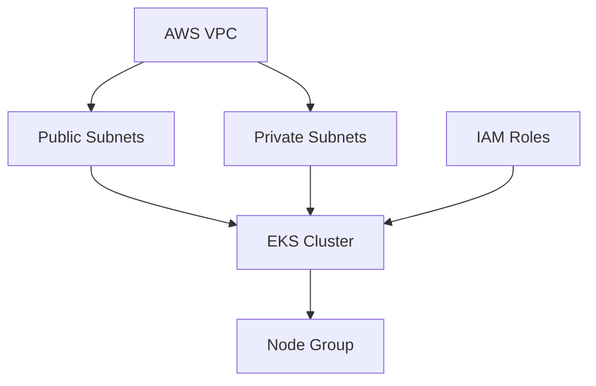

## Steps to Deploy EKS with Terraform

1. **Configure AWS Credentials**
    - Set up your AWS credentials using environment variables or AWS CLI.

2. **Initialize Terraform**
    ```bash
    terraform init
    ```

3. **Review and Edit `main.tf`**
    - Ensure your `main.tf` contains the necessary resources:
      - VPC
      - Subnets
      - IAM roles
      - EKS cluster
      - Node groups

4. **Validate Terraform Configuration**
    ```bash
    terraform validate
    ```

5. **Plan the Deployment**
    ```bash
    terraform plan
    ```

6. **Apply the Configuration**
    ```bash
    terraform apply
    ```

7. **Configure kubectl**
    - Update your kubeconfig to access the EKS cluster:
      ```bash
      aws eks update-kubeconfig --region <region> --name <cluster_name>
      ```

8. **Verify Cluster Access**
    ```bash
    kubectl get nodes
    ```

---

## Architecture Diagram



## Additional Components: ALB and IGW

### Internet Gateway (IGW)
- **What is it?**
    - An Internet Gateway allows resources within your VPC (such as public subnets) to connect to the internet.
- **Roles and Security Groups Affected:**
    - Public subnets associated with the IGW require route table entries pointing to the IGW.
    - Security groups for resources in public subnets (e.g., ALB) should allow inbound traffic from the internet as needed.

### Application Load Balancer (ALB)
- **What is it?**
    - The ALB distributes incoming application traffic across multiple targets (such as EC2 instances or EKS pods) in one or more availability zones.
- **Roles and Security Groups Affected:**
    - ALB requires an IAM role for integration with AWS services (e.g., for ingress controllers).
    - Security groups for the ALB should allow inbound traffic on required ports (e.g., 80/443) and outbound traffic to the target nodes.
    - Node groups or pods behind the ALB should have security groups allowing traffic from the ALB's security group.

---


**Legend:**
- **VPC**: Virtual Private Cloud
- **IGW**: Internet Gateway
- **RT**: Route Table
- **Public/Private Subnet**: Network Segmentation
- **ALB**: Application Load Balancer
- **EKS**: Elastic Kubernetes Service Cluster
- **Node Group (EC2)**: Worker Nodes
- **Security Group**: Firewall Rules
- **Inbound/Outbound Rules**: Traffic Control

